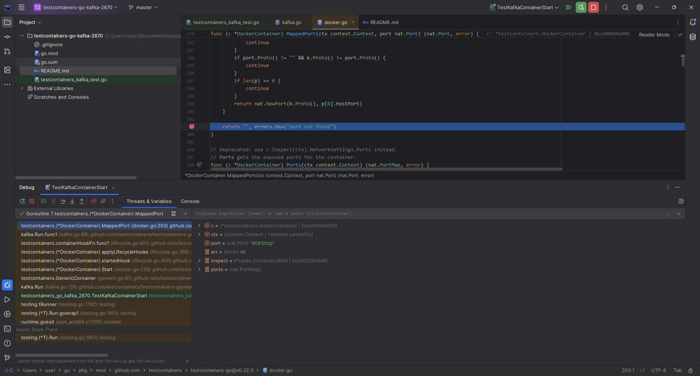

# Repro repo for testcontainers/testcontainers-go issue #2670

Reproducing https://github.com/testcontainers/testcontainers-go/issues/2670 (multiple tries can be required):

1. Environment
    1. Go SDK 1.23+
    1. Windows 11 23H2
    1. WSL
    1. Docker Desktop v4.41.2
1. Run the test
    ```shell
    go test -v -count 1 -timeout 20m ./...
    ```

Output of test when issue happens

```text
=== RUN   TestKafkaContainerStart
    testcontainers_kafka_test.go:24: starting container using image: confluentinc/confluent-local:7.5.0
    testcontainers_kafka_test.go:24: starting container using image: confluentinc/confluent-local:7.5.0
    testcontainers_kafka_test.go:24: starting container using image: confluentinc/confluent-local:7.5.0
    testcontainers_kafka_test.go:24: starting container using image: confluentinc/confluent-local:7.5.0
    testcontainers_kafka_test.go:24: starting container using image: confluentinc/confluent-local:7.5.0
    testcontainers_kafka_test.go:24: starting container using image: confluentinc/confluent-local:7.5.0
    testcontainers_kafka_test.go:24: starting container using image: confluentinc/confluent-local:7.5.0
    testcontainers_kafka_test.go:24: starting container using image: confluentinc/confluent-local:7.5.0
    testcontainers_kafka_test.go:24: starting container using image: confluentinc/confluent-local:7.5.0
    testcontainers_kafka_test.go:24: starting container using image: confluentinc/confluent-local:7.5.0
2025/05/14 17:17:41 github.com/testcontainers/testcontainers-go - Connected to docker:
  Server Version: 28.1.1
  API Version: 1.46
  Operating System: Docker Desktop
  Total Memory: 7944 MB
  Testcontainers for Go Version: v0.32.0
  Resolved Docker Host: npipe:////./pipe/docker_engine
  Resolved Docker Socket Path: //var/run/docker.sock
  Test SessionID: 17500ae6967ce6989b6303b14d61aceb1a2d1e73e71972bf71a01c2e6d70dcca
  Test ProcessID: fca9f2ea-0587-4e4a-86d6-16ca453fe47d
2025/05/14 17:17:41 🐳 Creating container for image testcontainers/ryuk:0.7.0
2025/05/14 17:17:42 ✅ Container created: d170ff53fc66
2025/05/14 17:17:42 🐳 Starting container: d170ff53fc66
2025/05/14 17:17:42 ✅ Container started: d170ff53fc66
2025/05/14 17:17:42 ⏳ Waiting for container id d170ff53fc66 image: testcontainers/ryuk:0.7.0. Waiting for: &{Port:8080/tcp timeout:<nil> PollInterval:100ms}
2025/05/14 17:17:42 🔔 Container is ready: d170ff53fc66
2025/05/14 17:17:42 🐳 Creating container for image confluentinc/confluent-local:7.5.0
2025/05/14 17:17:42 🐳 Creating container for image confluentinc/confluent-local:7.5.0
2025/05/14 17:17:42 🐳 Creating container for image confluentinc/confluent-local:7.5.0
2025/05/14 17:17:42 🐳 Creating container for image confluentinc/confluent-local:7.5.0
2025/05/14 17:17:43 🐳 Creating container for image confluentinc/confluent-local:7.5.0
2025/05/14 17:17:43 🐳 Creating container for image confluentinc/confluent-local:7.5.0
2025/05/14 17:17:43 🐳 Creating container for image confluentinc/confluent-local:7.5.0
2025/05/14 17:17:43 🐳 Creating container for image confluentinc/confluent-local:7.5.0
2025/05/14 17:17:43 🐳 Creating container for image confluentinc/confluent-local:7.5.0
2025/05/14 17:17:43 🐳 Creating container for image confluentinc/confluent-local:7.5.0
2025/05/14 17:17:43 ✅ Container created: eb06ae8c9064
2025/05/14 17:17:43 🐳 Starting container: eb06ae8c9064
2025/05/14 17:17:43 ✅ Container created: 4cda119749fd
2025/05/14 17:17:43 🐳 Starting container: 4cda119749fd
2025/05/14 17:17:43 ✅ Container created: 0bd0091205da
2025/05/14 17:17:43 🐳 Starting container: 0bd0091205da
2025/05/14 17:17:43 ✅ Container created: e082ae6c9f74
2025/05/14 17:17:43 🐳 Starting container: e082ae6c9f74
2025/05/14 17:17:43 ✅ Container created: 37d52c0ac8a5
2025/05/14 17:17:43 🐳 Starting container: 37d52c0ac8a5
2025/05/14 17:17:43 ✅ Container created: 31a5ff67c8e4
2025/05/14 17:17:43 🐳 Starting container: 31a5ff67c8e4
2025/05/14 17:17:43 ✅ Container created: ce82d2846a33
2025/05/14 17:17:43 🐳 Starting container: ce82d2846a33
2025/05/14 17:17:43 ✅ Container created: 7c59246b4d82
2025/05/14 17:17:43 🐳 Starting container: 7c59246b4d82
2025/05/14 17:17:43 ✅ Container created: e013810e81ef
2025/05/14 17:17:43 🐳 Starting container: e013810e81ef
2025/05/14 17:17:43 ✅ Container created: ae01d6ae8b23
2025/05/14 17:17:43 🐳 Starting container: ae01d6ae8b23
2025/05/14 17:18:05 ✅ Container started: 4cda119749fd
2025/05/14 17:18:05 🔔 Container is ready: 4cda119749fd
    testcontainers_kafka_test.go:36: successfully started container: 4cda119749fdaed497d5ec85ec1d3b1df28570161ee797867097adf6ac658a24
    testcontainers_kafka_test.go:30: terminating container: 4cda119749fdaed497d5ec85ec1d3b1df28570161ee797867097adf6ac658a24
2025/05/14 17:18:05 🐳 Terminating container: 4cda119749fd
2025/05/14 17:18:06 ✅ Container started: 31a5ff67c8e4
2025/05/14 17:18:06 🔔 Container is ready: 31a5ff67c8e4
    testcontainers_kafka_test.go:36: successfully started container: 31a5ff67c8e448aa9ed0c889e8f1727904c615018aef200c54d8686d47e4fb8b
    testcontainers_kafka_test.go:30: terminating container: 31a5ff67c8e448aa9ed0c889e8f1727904c615018aef200c54d8686d47e4fb8b
2025/05/14 17:18:06 🐳 Terminating container: 31a5ff67c8e4
2025/05/14 17:18:06 ✅ Container started: eb06ae8c9064
2025/05/14 17:18:06 🔔 Container is ready: eb06ae8c9064
    testcontainers_kafka_test.go:36: successfully started container: eb06ae8c9064a5fafcfe7bc05e323f146099697595099da2710e6aaab52f8bbb
    testcontainers_kafka_test.go:30: terminating container: eb06ae8c9064a5fafcfe7bc05e323f146099697595099da2710e6aaab52f8bbb
2025/05/14 17:18:06 🐳 Terminating container: eb06ae8c9064
2025/05/14 17:18:06 ✅ Container started: 37d52c0ac8a5
2025/05/14 17:18:06 🔔 Container is ready: 37d52c0ac8a5
    testcontainers_kafka_test.go:36: successfully started container: 37d52c0ac8a5ec4779e28088d0b991b90e3efcd71462f7966918eaa0df4b85f0
    testcontainers_kafka_test.go:30: terminating container: 37d52c0ac8a5ec4779e28088d0b991b90e3efcd71462f7966918eaa0df4b85f0
2025/05/14 17:18:06 🐳 Terminating container: 37d52c0ac8a5
2025/05/14 17:18:06 ✅ Container started: ce82d2846a33
2025/05/14 17:18:06 🔔 Container is ready: ce82d2846a33
    testcontainers_kafka_test.go:36: successfully started container: ce82d2846a33bbe484e61d47e444dc429df7efb29c679e2e8b40f2fcc3728af2
    testcontainers_kafka_test.go:30: terminating container: ce82d2846a33bbe484e61d47e444dc429df7efb29c679e2e8b40f2fcc3728af2
2025/05/14 17:18:06 🐳 Terminating container: ce82d2846a33
2025/05/14 17:18:06 ✅ Container started: e082ae6c9f74
2025/05/14 17:18:06 ✅ Container started: e013810e81ef
2025/05/14 17:18:06 🔔 Container is ready: e013810e81ef
    testcontainers_kafka_test.go:36: successfully started container: e013810e81ef0c822ad2fa7410b0721e133116af726229efa446926c08e806f6
    testcontainers_kafka_test.go:30: terminating container: e013810e81ef0c822ad2fa7410b0721e133116af726229efa446926c08e806f6
2025/05/14 17:18:06 🐳 Terminating container: e013810e81ef
2025/05/14 17:18:06 🔔 Container is ready: e082ae6c9f74
    testcontainers_kafka_test.go:36: successfully started container: e082ae6c9f743c9ad49dedacb30edf4f49f317ea7f122bb5eb51be46b299f950
    testcontainers_kafka_test.go:30: terminating container: e082ae6c9f743c9ad49dedacb30edf4f49f317ea7f122bb5eb51be46b299f950
2025/05/14 17:18:06 🐳 Terminating container: e082ae6c9f74
2025/05/14 17:18:06 ✅ Container started: 7c59246b4d82
2025/05/14 17:18:06 🔔 Container is ready: 7c59246b4d82
    testcontainers_kafka_test.go:36: successfully started container: 7c59246b4d82e96975c69ab7f0242d8fe2746ffd2827bad8d66860a56484ecb9
    testcontainers_kafka_test.go:30: terminating container: 7c59246b4d82e96975c69ab7f0242d8fe2746ffd2827bad8d66860a56484ecb9
2025/05/14 17:18:06 🐳 Terminating container: 7c59246b4d82
2025/05/14 17:18:07 🚫 Container terminated: 4cda119749fd
2025/05/14 17:18:07 🚫 Container terminated: 31a5ff67c8e4
2025/05/14 17:18:08 🚫 Container terminated: eb06ae8c9064
2025/05/14 17:18:08 🚫 Container terminated: 37d52c0ac8a5
2025/05/14 17:18:08 🚫 Container terminated: ce82d2846a33
2025/05/14 17:18:08 🚫 Container terminated: e013810e81ef
2025/05/14 17:18:09 🚫 Container terminated: 7c59246b4d82
2025/05/14 17:18:09 🚫 Container terminated: e082ae6c9f74
2025/05/14 17:18:44 ✅ Container started: 0bd0091205da
2025/05/14 17:18:44 container logs (port not found
context deadline exceeded):

2025/05/14 17:18:44 ✅ Container started: ae01d6ae8b23
2025/05/14 17:18:44 container logs (port not found
context deadline exceeded):

    testcontainers_kafka_test.go:42: failed to run Kafka container: container start failed: failed to start container: port not found
        context deadline exceeded
--- FAIL: TestKafkaContainerStart (63.00s)
FAIL
FAIL    github.com/mabrarov/testcontainers-go-kafka-2670        63.093s
FAIL
```

The same issue in debugger



Please note that this issue is a sort of race condition - it depends on time b/w container started and
github.com/testcontainers/testcontainers-go/modules/kafka checked for the mapped port.
It makes this issue happening intermittently, so multiple (5-20) tries can be required to reproduce issue.
